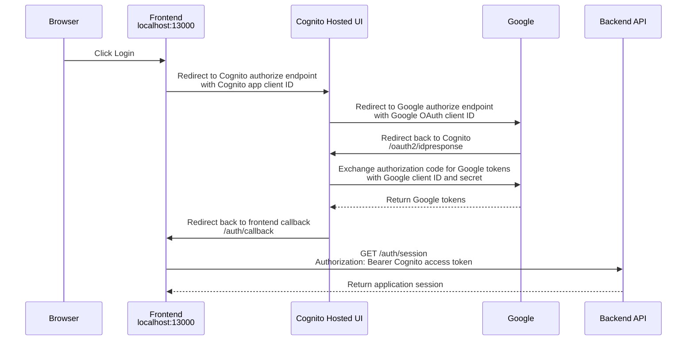

# Cognito and Google OAuth Flow

This document explains how the frontend, Amazon Cognito, and Google use OAuth
configuration values during sign-in.

The most important point is that there are two different OAuth clients:

- The Cognito app client, used between the frontend and Cognito.
- The Google OAuth client, used between Cognito and Google.

They both have a "client ID", but they belong to different systems and are used
at different times.

## Summary

The frontend knows Cognito.

Cognito knows Google.

Google authenticates the user and returns the result to Cognito.

Then Cognito converts the Google authentication result into Cognito-managed
tokens and returns the browser to the frontend.

```text
Frontend
  knows Cognito settings
  - Cognito authority
  - Cognito app client ID
  - Frontend callback URL
  |
  v
Cognito
  knows Google provider settings
  - Google OAuth client ID
  - Google OAuth client secret
  - Google scopes
  |
  v
Google
  authenticates the user
  returns an authorization code to Cognito
  |
  v
Cognito
  exchanges the Google authorization code for Google tokens
  issues Cognito tokens
  |
  v
Frontend
  receives the Cognito login result
```

In short:

```text
Frontend does not know Google directly.
Cognito acts as the bridge between the application and Google.
Google returns to Cognito, not to the frontend.
Cognito returns to the frontend after it has completed its own login process.
```

The Google client secret is not sent at the beginning of login because the
beginning of login is a browser redirect.

```text
Before user login:
Cognito -> Browser -> Google

Only public request values are sent:
- Google OAuth client ID
- redirect URI
- scopes
```

The client secret is used later, after Google has returned an authorization
code to Cognito.

```text
After user login:
Cognito -> Google

Server-to-server token exchange uses:
- authorization code
- Google OAuth client ID
- Google OAuth client secret
```

The authorization code proves that the user completed Google login. The client
secret proves that the party exchanging the code is the authorized Google OAuth
client owner. Sending the secret during the initial browser redirect would
expose it and would not help because there is no authorization code to exchange
yet.

## Big Picture



## Step 1: Frontend Starts Cognito Login

The frontend does not call Google directly.

When the user clicks Login, the frontend starts the Cognito login flow by
redirecting the browser to Cognito.

The frontend knows these values:

- `authority`: identifies the Cognito user pool.
- `client_id`: identifies the Cognito app client.
- `redirect_uri`: tells Cognito where to return after Cognito login finishes.

Example frontend values:

```text
authority =
https://cognito-idp.ap-northeast-1.amazonaws.com/ap-northeast-1_rkSuB16Vu

client_id =
5m9endllggd3urihf6t8gd0k2r

redirect_uri =
http://localhost:13000/auth/callback
```

The OIDC client library uses `authority` to discover Cognito endpoints from:

```text
https://cognito-idp.ap-northeast-1.amazonaws.com/ap-northeast-1_rkSuB16Vu/.well-known/openid-configuration
```

Then it redirects the browser to Cognito with a URL like this:

```text
https://<cognito-domain>/oauth2/authorize
  ?client_id=<cognito-app-client-id>
  &redirect_uri=http://localhost:13000/auth/callback
  &response_type=code
  &scope=openid email profile
  &state=<random-value>
  &nonce=<random-value>
  &code_challenge=<pkce-value>
  &code_challenge_method=S256
```

Cognito uses the Cognito app client ID to find the app client settings inside
the user pool.

Cognito checks:

- Does this app client exist?
- Is this OAuth flow allowed?
- Are these scopes allowed?
- Is the provided `redirect_uri` registered in this app client?

The Cognito app client ID does not automatically decide the redirect URL. The
frontend sends `redirect_uri`, and Cognito checks whether it is allowed.

## Step 2: Cognito Starts Google Login

After the browser reaches Cognito Hosted UI, Cognito starts the Google login
flow because Google is configured as an identity provider.

This configuration is created in Terraform with `aws_cognito_identity_provider`.

Cognito knows these Google values:

- Google OAuth client ID.
- Google OAuth client secret.
- Google scopes such as `openid`, `email`, and `profile`.

Cognito redirects the browser to Google with a URL like this:

```text
https://accounts.google.com/o/oauth2/v2/auth
  ?client_id=<google-oauth-client-id>
  &redirect_uri=https://vicente-calderon-dev-auth.auth.ap-northeast-1.amazoncognito.com/oauth2/idpresponse
  &response_type=code
  &scope=openid email profile
  &state=<random-value>
```

At this point, Google checks the Google OAuth client configuration.

Google checks:

- Does this Google OAuth client ID exist?
- Is the requested redirect URI registered for this Google OAuth client?
- Is the OAuth consent screen valid for this request?

If the redirect URI is not registered exactly, Google returns:

```text
redirect_uri_mismatch
```

## Step 3: Google Returns to Cognito

After Google login succeeds, Google redirects the browser back to Cognito.

The redirect target is:

```text
https://vicente-calderon-dev-auth.auth.ap-northeast-1.amazoncognito.com/oauth2/idpresponse
```

This is not a frontend route.

This is not a backend API route.

It is a fixed Cognito endpoint used to receive responses from external identity
providers such as Google.

The path `/oauth2/idpresponse` is managed by Cognito.

## Step 4: Cognito Exchanges the Google Code

Google returns an authorization code to Cognito.

Cognito then calls Google's token endpoint from the server side.

At this point, Cognito uses:

- Google OAuth client ID.
- Google OAuth client secret.
- The authorization code returned by Google.

The client secret is used here because Cognito must prove to Google that it is
the real owner of the Google OAuth client.

The frontend must never use or receive this secret.

## Step 5: Cognito Returns to the Frontend

After Cognito accepts the Google login result, Cognito issues Cognito tokens.

Then Cognito redirects the browser back to the frontend callback URL:

```text
http://localhost:13000/auth/callback
```

This URL is registered in the Cognito app client as a callback URL.

This URL is not the same as the Google redirect URI.

## Configuration Values

### Cognito App Client ID

Used by:

- Frontend.
- Cognito.

Used when:

- The frontend starts login by redirecting to Cognito.

Purpose:

- Identifies which Cognito app client is requesting login.
- Allows Cognito to validate OAuth flow, scopes, and callback URLs.

Example:

```text
5m9endllggd3urihf6t8gd0k2r
```

### Google OAuth Client ID

Used by:

- Cognito.
- Google.

Used when:

- Cognito starts Google login.

Purpose:

- Identifies Cognito's Google OAuth client to Google.
- Allows Google to validate the request against the Google Cloud Console OAuth
  client configuration.

Configured in:

```text
infra/envs/dev/terraform.tfvars
```

Passed to Cognito by:

```text
aws_cognito_identity_provider.google.provider_details.client_id
```

### Google OAuth Client Secret

Used by:

- Cognito.
- Google.

Used when:

- Cognito exchanges the Google authorization code for Google tokens.

Purpose:

- Proves to Google that Cognito is allowed to use the Google OAuth client.

Important rule:

- The frontend must never use this value.
- It must not be committed to Git.

### Authorized JavaScript Origin

Used by:

- Google.

Used when:

- Browser JavaScript directly talks to Google OAuth or Google APIs.

Purpose:

- Restricts which browser origins are allowed to use the Google OAuth client
  from JavaScript.

For this Cognito Hosted UI flow, the frontend does not directly call Google.
The direct Google OAuth caller is Cognito.

If Google Console asks for an origin, use the Cognito origin:

```text
https://vicente-calderon-dev-auth.auth.ap-northeast-1.amazoncognito.com
```

An origin contains only scheme, host, and optional port.

It does not contain a path.

### Authorized Redirect URI

Used by:

- Google.

Used when:

- Google finishes login and redirects back to the OAuth client.

Purpose:

- Prevents Google from sending authorization codes to arbitrary URLs.

For this Cognito Hosted UI flow, Google must return to Cognito:

```text
https://vicente-calderon-dev-auth.auth.ap-northeast-1.amazoncognito.com/oauth2/idpresponse
```

This value must be registered exactly in Google Cloud Console.

If only the origin is registered, it is not enough:

```text
https://vicente-calderon-dev-auth.auth.ap-northeast-1.amazoncognito.com
```

Google requires the full redirect URI including the path.

## Two Redirect URLs

There are two redirect URLs in this architecture.

Google to Cognito:

```text
https://vicente-calderon-dev-auth.auth.ap-northeast-1.amazoncognito.com/oauth2/idpresponse
```

Registered in:

```text
Google Cloud Console OAuth client
```

Cognito to Frontend:

```text
http://localhost:13000/auth/callback
```

Registered in:

```text
Cognito app client callback URLs
```

These URLs are different because Google and Cognito return to different
receivers.

## Mental Model

Think of the flow as two contracts.

Contract 1: Frontend and Cognito

```text
Frontend says:
"Cognito, start login for this Cognito app client.
When you finish, return to http://localhost:13000/auth/callback."

Cognito checks:
"Is this callback URL allowed for this Cognito app client?"
```

Contract 2: Cognito and Google

```text
Cognito says:
"Google, start login for this Google OAuth client.
When you finish, return to my /oauth2/idpresponse endpoint."

Google checks:
"Is this redirect URI allowed for this Google OAuth client?"
```

If Contract 2 is wrong, Google returns `redirect_uri_mismatch`.

## Common Misunderstandings

The Cognito app client ID and Google OAuth client ID are not the same thing.

`http://localhost:13000/auth/callback` is not registered in Google Cloud Console
for this flow. It is registered in Cognito.

`/oauth2/idpresponse` is not implemented by this application. It is implemented
by Cognito.

The Google OAuth client secret is not used by the frontend. It is used by
Cognito when talking to Google.

The authorized JavaScript origin is not the same as the authorized redirect URI.
The origin has no path. The redirect URI has the full callback path.
