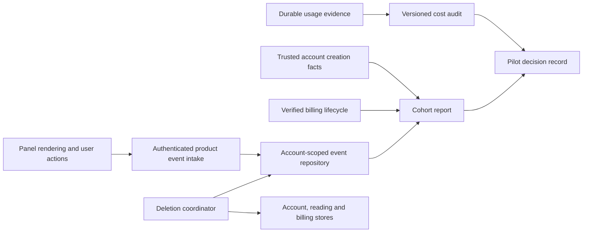

# Monetization development design

Date: 2026-09-18. Status: design for later implementation.
The user requested documentation and commits, not implementation of M01–M10.
The completed RM-01–RM-14 reliability work remains the starting point. Prices,
quotas, provider configuration and deployed behavior are unchanged by this design.
Market research and numerical scenarios retain their September 9 dates; no
current rate, legal requirement or market demand has been newly verified.

Read [the strategy](MONETIZATION_STRATEGY.md), [roadmap](MONETIZATION_ROADMAP.md),
[implementation checkpoint](IMPLEMENTATION_STATUS.md) and
[product experience design](PRODUCT_EXPERIENCE_DESIGN.md) together. The latter
specifies M03–M05 and conditional M08. This document specifies M01, M02, M06,
M07, M09, M10 and their shared boundaries.

## Architecture and ownership

Reuse `backend/core/plans.py`, `backend/services/usage_meter.py`, durable usage
repositories, `backend/accounts/services/billing_flow.py` and account-scoped
terminal activity. Product analytics must not become a billing ledger or a
prerequisite for reading. There is no external analytics vendor in this design.

Keep new application services feature-local with injected repository/clock/provider
ports. Start with JSON and in-memory adapters; add a Dynamo adapter before enabling
the corresponding feature in a Dynamo deployment. Do not silently substitute JSON
inside a production Lambda. Define proposed HTTP changes in `contracts/openapi/`
and generate consumers through the existing tasks. Existing Python/JavaScript
modules retain their language. New executable modules must follow the applicable
repository language rule, with a compatible TypeScript build boundary designed
before adding TypeScript to the vanilla extension; no framework migration is planned.

New persisted domain entities use UUID v7 `id` values. The authenticated owner is
server-derived; a request never supplies an authoritative `user_id`. All mutations
must be idempotent across retries, account changes and concurrent repository instances.

## M01: reproducible cost audit

Deliver a versioned scenario fixture, deterministic evaluator and Markdown/JSON
report via a future canonical `task monetization:cost-audit`. It must run without
provider calls, credentials or customer content. The command is proposed, not
currently available. Locate evaluator/report ownership beside usage accounting;
keep scenario fixtures under a dedicated monetization test/data directory.

Inputs: schema/scenario version; source revision; plan limits; model identifiers;
input/output/cached-token rates in integer micro-USD per million tokens; rate source
and observation date; tax-inclusive price; assumed tax divisor; fee components;
FX scenario; infrastructure/support/refund allowance. The existing integer cost
calculation is authoritative. Use Decimal/rational arithmetic for comparisons and
round only display values. Do not infer a current rate from a model name or code default.

Each workload row has a synthetic account, operation identity, article/chat/selection
kind, UTC month, retry/fallback/uncertainty status and observed numeric usage. Include
cache hits, long articles, supported sentence caps, full visible quotas, partial
failure, missing usage, duplicate delivery and month boundaries. Keep actual numeric
cost, conservative settlement bound and unknown evidence separate. A missing actual
charge is not zero, and a conservative bound is not an invoice measurement. Assert
that duplicate settlements are not counted as additional operations.

Outputs: workload cost and bound by plan; quota/cost-denial point; advertised work
completed before denial; unknown-evidence count; AI share of net revenue after fees;
residual before and after the explicit variable-cost allowance; sensitivity to FX
and model rates. Include every input/version so another engineer can reproduce it.
The 30% rule uses the unrounded ratio and fails closed on missing required inputs.
Report scenario pass/fail separately from readiness for real customers.

The dated Max example fails the rule; do not change its live allowance automatically.
The decision record must compare a verified lower-cost workload/model, a revised
new-customer price, or postponing Max sales, including effects on existing promises.
Actual rates, account fee terms and observed workloads are inputs to confirm before
selecting a remedy. No remedy is selected by this documentation commit.

Acceptance: deterministic golden scenarios; exact boundary at/below/above 30%; FX
sensitivity; joint article/chat/uncached cost; known-plus-uncertain failures and
complete exact measurements; immutable accepted RM accounting regressions stay green.
A later explicitly authorized provider/invoice audit is needed for measured economics.

## M02: minimal first-party measurement

### Proposed records and ingestion

Introduce a ProductEventRepository with atomic append-or-return-original by
`(user_id, id)` and owner/date queries. Event fields: `id`, server-derived `user_id`,
`schema_version=1`, allowlisted `type`, `received_at`, validated `occurred_at`, and a
strict typed payload. Reusing an ID with another payload returns a conflict; another
account may independently use the same ID. JSON uses the existing lock across the
whole read/modify/write; Dynamo uses a conditional owner/event key and time index.

Propose authenticated `POST /product-events` with at most 20 events and a 16 KiB body.
Return per-event accepted/duplicate/rejected results so one invalid event does not
force retries of successful ones. Authentication failure rejects the whole request;
unsupported version, malformed UUID/time or unknown fields are explicit errors.
Apply a finite per-account intake rate limit before writes; no article/token quota
is consumed. Select the operational rate and storage budget before implementation
acceptance, using load fixtures rather than an unlimited default.

Client events: `sample_viewed`, `explanation_rendered`, `word_revisited`,
`upgrade_viewed`, `revisit_prompt_dismissed`. Payload contains only enums/booleans:
source=`sample|own_article`, rendering=`new|cached`, placement and action as needed.
A validated operation/preload UUID may be supplied only when the server verifies its
owner; do not forward page text, URL, title, selected word, email, prompt or free text.
Product events cannot assert price, payment, entitlement, plan or measured cost.
Sample rendering never supplies an own-article activation event.

Record first successful sign-in/account creation and checkout attempts server-side.
The current public User model has no creation timestamp: add an internal enrollment
record, not an inferred timestamp from an arbitrary login or UUID. Auth persistence
must report trusted newly-created/existing status (proposed internal port change).
Classify legacy/unknown accounts separately and exclude them from new-user conversion.
A versioned cohort stores eligibility/exclusion reason and the server observation start;
mock/test/internal classification comes from trusted configuration, not the client.
Anonymous installs and first-run counts are outside the initial signed-in funnel.

Queue at most 100 events per authenticated account in extension local storage, with
stable IDs, bounded exponential backoff and a 24-hour retry horizon. Preserve IDs on
retry. Drop that account's unsent events on logout; bind callbacks to the account and
authentication generation so a late acknowledgement cannot mutate another queue.
Analytics errors, queue overflow and a disabled collector never block product actions.
Record aggregate dropped/late counts without recording private payloads in logs.

Allow event occurrence up to 24 hours before receipt and five minutes into the future;
reject timestamps outside that range rather than silently shifting their cohort.
Client events are observations, not trusted billing facts. Publish reports only after
the metric window plus the 24-hour upload grace has elapsed. Flag device-clock
uncertainty and report late/dropped records separately. These cutoffs are proposed
measurement policy, not evidence that the observed user achieved a learning outcome.

### Cohort and billing truth

Use metric-specific cohorts. For these launch metrics, day zero is the trusted
first successful sign-in of a known-new eligible account; every interval is UTC
and half-open. Qualified activation is an own-article explanation rendered in
[day 0, day 1). Legacy, mock, test and internal accounts are reported separately.

| Metric | Denominator | Numerator | Earliest publication |
| --- | --- | --- | --- |
| Activation | All eligible new signed-in accounts | Those with qualified activation | Signup + 24 hours + 24-hour upload grace |
| D7 return | Qualified activated accounts in that same signup cohort | Those rendering an explanation in [signup + 7 days, signup + 14 days) | Signup + 14 days + 24-hour upload grace |
| Paid by day 30 | Qualified activated accounts in that same signup cohort | Those with first verified paid subscription in [signup, signup + 30 days) | Signup + 30 days + 24-hour processing grace |

Each numerator is restricted to its own denominator; the three denominators are
not interchangeable. Late activation is a separate diagnostic, not silently
inserted into these cohorts. First-run/sample/cached activity is labelled, not
counted as a new billable analysis. Report counts, exclusions and censored records
with rates; zero eligible users yields no rate. Renewal anchors remain the
scheduled billing-period boundary rather than signup.

Checkout start is the persisted server attempt, deduplicated by its canonical
operation identity. Count success only from an owned, verified paid subscription;
provider processing timestamp and received timestamp are distinct. Close the report
after its 24-hour window plus upload/processing grace; later settlement stays in a
separate late column rather than retroactively appearing within the window.

For M09, persist a trusted renewal-opportunity record for each scheduled billing
period before account state or cancellation can overwrite it. Identify it by provider
subscription and period boundary, with an internal UUID v7 `id`. Verified billing
settlement updates the same opportunity idempotently. Advance cancellations remain
in the denominator; cancellation and failed collection stay distinct. Reconcile
out-of-order webhooks from authoritative billing state without duplicating renewals.
Use the scheduled date plus seven days and report first/second renewals separately.
A success redirect, mock activation or client event cannot create paid conversion.

Retention proposal: expire raw product events after 90 days, enforce expiry at read
time and with a cleanup job (Dynamo TTL alone is not an exact deletion deadline).
Retain only sufficiently coarse, non-identifying cohort totals for longer comparisons;
version the aggregation policy and forbid per-user drill-down from retained aggregates.
Account deletion removes raw product events and identifiable enrollment/joins.
Before erasing enrollment, close its event intake and atomically finalize its
contribution to policy-approved, non-identifying cohort counters: fixed eligible
count, known successes and a censored count for each unfinished metric window.
Use an idempotent repository transition so retrying deletion cannot add that
contribution twice; after finalization remove identifying analytics joins rather
than preserving them until maturity. The pending aggregate retains no account,
event, operation or provider identifier. Coarsen/suppress small groups according
to the adopted policy before publication; no raw per-user drill-down is retained.

For pending as well as published cohorts, deleted nonconverters remain in their
original eligible denominator. A known success before deletion remains a success;
unknown post-deletion behavior is censored, never imputed as a success. Publish
only after the whole signup bucket's last possible window plus grace matures.
Show censored counts and label the success/eligible ratio an observed lower bound
when censored users exist. Never present it as a fully observed conversion rate.
Validate the aggregate/privacy policy before collection; deletion must not be
blocked just to preserve analytics. Include delete-before-activation/day-13/day-30
and crash/retry cases in the cohort fixtures.

Acceptance: new/legacy/test exclusions; mature denominators and upload grace; same
and cross-account retry collisions; logout race; no forbidden fields; expiry/deletion;
o client-created payment; duplicated/out-of-order renewal events; advance cancellation;
late settlement and zero denominators; reading succeeds during collector failure.

## M06: account deletion as a recoverable workflow

Create an authenticated deletion preview and an explicit confirmed request, after
fresh authentication. Proposed endpoints: `GET /account/deletion-preview`,
`POST /account/deletions` (idempotency key and confirmation), and a status endpoint
limited to the same authenticated owner or a short-lived, read-only deletion receipt.
Exact route schemas and receipt authentication belong to contract design before code.
A receipt cannot read content, modify billing or restore an account; never put it in a URL.

Proposed DeletionJob: UUID v7 `id`, owner, state/version, requested time, per-adapter
checkpoints, cancellation reference and sanitized failure classification. States:
`requested -> access_blocked -> billing_confirmed -> erasing -> completed`, with
retryable failures resuming the same checkpoint. This is separate from admin suspension.
Once accepted, block new login/upsert and new paid/provider work, revoke existing
sessions and fence queued/in-flight writers. A worker must validate the deletion
fence at dispatch and before publishing; a stale callback cannot recreate erased data.

Inventory to complete before implementation acceptance:

| Data surface | Existing ownership | Proposed deletion behavior |
| --- | --- | --- |
| Identity/profile/email uniqueness/session records | `accounts/storage`, `auth/dynamodb_email_auth.py`, session repositories | Revoke access immediately; erase identifying records only after the external cancellation dependency is resolved |
| Preload documents, sentences, analyses and study items | JSON/Dynamo page preload repositories | Owner-scoped resumable deletion, including descendants and late-write fences |
| Saved phrases and extension caches | JSON/Dynamo phrase adapters, account-scoped extension storage | Erase owned records; invalidate/purge local cache on receipt; other devices clear on denied/revoked session |
| Transient input/private results/queued jobs | preload content store, usage repository private results, job runners | Delete private content and prevent late resurrection; terminate/reconcile already dispatched work without double settlement |
| Activity/product events/enrollment | activity adapters and proposed M02 stores | Delete identifiable records and raw events; retain only policy-approved non-identifying aggregates |
| Subscription, checkout, usage and billing history | subscription/billing repositories and provider adapter | Minimize identifying joins; retain only records justified by the adopted retention policy, with purpose and expiration |
| Logs, backups and provider-held records | deployment/storage/provider inventory | Document actual retention and expiry, restricted access and restore-time deletion replay; no claim of immediate physical erasure |

Deletion must first neutralize outstanding checkout work, including previously
issued hosted URLs and creation requests already in flight. Inventory persisted
checkout operations and provider references, expire/disable open sessions, and
reconcile uncertain creation to a terminal provider state. A completion racing
deletion may create a subscription: cancel and reconcile that subscription while
keeping account access blocked. Local webhook rejection alone cannot prevent
provider charges. Retain the minimal joins needed for recovery while any such
operation is unresolved. Require the outstanding-checkout barrier and confirmed
subscription cancellation before entering billing_confirmed. If the provider
cannot invalidate a session, wait for its verified expiry/terminal outcome; do
not treat a local timestamp as proof. Add checkout-completes-during-deletion and
late-created-session regression cases.

Deletion must not leave a recurring subscription charging silently. Introduce a
provider port for idempotent immediate cancellation with confirmed no-future-charge
state, then reconcile independently from authoritative provider status. If cancellation
fails or is uncertain, keep the job blocked/retryable, preserve the minimal provider
link needed to retry and show an honest pending state. Do not announce completion.
Refund/proration decisions are an unresolved policy input, not silently delegated to
provider defaults. Existing portal cancellation remains usable until the request is
confirmed. No refund or live cancellation is executed by the documentation task.

Use a minimal deletion fence independent of the profile to block replayed sign-in,
checkout, webhook and worker writes; retain it for the documented maximum replay
horizon. Define the fence's identifier/privacy treatment and expiry in the inventory.
Do not recreate an account from a late webhook. A deliberate future sign-up must be
explicitly distinguished from replay and use a new opaque account ID. Keep a bounded,
auditable erasure receipt without article text, email or payment credentials.

Add bulk owner-delete/list/checkpoint ports rather than using direct adapter file
access in the HTTP handler. JSON deletion holds the existing canonical-path lock;
Dynamo deletion walks pages and checkpoints batches, with conditional fencing and
idempotent retries. There is no single cross-store transaction: the durable coordinator
is the source of progress. Separate authorization, cancellation and physical erasure.
Before release, choose and document retry/alert deadlines and actual retained-data
periods; absent a justified policy, do not enable deletion or claim legal compliance.

Acceptance: owner isolation, fresh-auth failure, duplicate requests, partial batch
failure, cancellation timeout/late success, restart, pending-worker race, late webhook,
restore replay and multi-device logout. No recurring charge after a completed request;
no private data recreation; completion only when every required checkpoint succeeds.
M06's 4–7 day estimate must be re-estimated after this inventory and port design.

## M07: release and disclosure package

Produce original/licensed demo material, landing/store copy, accurate plan comparison,
permission explanation, support/reset path, privacy/data inventory, cancellation and
deletion instructions. Assets describe supported workflows and limitations; no invented
learning gains or audience proof. The demo must not masquerade as production usage.

Reuse `docs/RELEASE_RUNBOOK.md`, extension packaging and the existing protected
plan/apply workflow. A release packet binds source revision, artifact digest, local
quality receipts, account/data policy, configured rates/allowances and test outcomes.
Before a paid pilot, separately authorize and verify store-installed sign-in,
own-article rendering, purchase, entitlement update, cancellation and deletion against
the intended environment. Include alerts and a support owner; mock success is not
live-sale evidence. Publication, billing changes and infrastructure apply remain
separate actions from documentation or local implementation acceptance.

## M08–M10: conditional experiments

M08's product behavior is in the companion design; enable only after evidence that
saved material is revisited. M09's renewal denominator/storage is specified in M02;
optional cancellation feedback is skippable, enum-based and never blocks cancellation.
Set a retention limit before collecting any optional free text; initial scope excludes it.
M10 begins only after the strategy's mature-renewal and positive-contribution gates.
Record one target audience/channel, hypothesis, budget/time cap, observation window
and stop criterion. Annual plans, teams and scheduled reviews are separate proposals,
not bundled implementation tasks. No outreach, advertising or publication is started.

## Delivery slices and verification

1. M01 scenario/evaluator/report with all synthetic fixtures and economics decision record.
2. M02 internal enrollment, event schema/adapters, bounded extension queue and cohort report;
   prove legacy exclusion, privacy and failure isolation before switching on collection.
3. M03/M04/M05 in separate feature branches per companion design; M01/M02 first.
4. M06 inventory and policy decisions, then cancellation/fencing and resumable erasure.
5. M07 release evidence and paid-pilot readiness; conditional M08/M09, then M10.

Each slice gets a reviewed task specification, exact diff and canonical container
checks. Changes to contracts require api:generate and api:check. Backend work needs
unit/admin tests, lint and format; extension work needs unit/package/managed smoke;
combined acceptance needs task check. Real-provider, normal-profile Chrome and
store-installed checks require their own evidence. No executable implementation is
included in the design commit.

Use independent feature flags for analytics, onboarding/revisit UI and deletion intake.
Defaults stay disabled until the relevant acceptance gates pass. Disabling analytics
must stop intake/queueing without breaking reading; disabling deletion intake must not
stop already accepted deletion jobs. Rollback must preserve accounting evidence,
existing subscriptions and deletion fences. Never roll back by deleting user records
or restoring erased data. Record schema/version compatibility and migration recovery
before enabling a new writer.

Open decisions for implementation: verified model/account rates and FX budget;
new-customer price/Max remedy; measurement consent/retention policy; rate/storage budgets;
delete/cancel/refund policy and replay/backup horizons; supported browser/store matrix;
support owner and available team capacity. These are explicit inputs to later tasks,
not unresolved implementation work in this documentation-only delivery.
