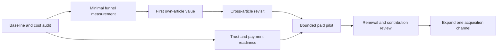

# Monetization implementation roadmap

Date: 2026-09-09. M01–M10 remain a proposed commercial backlog.
Execution reconciliation: 2026-09-15; the separate 27-finding reliability
remediation is complete. See [the implementation checkpoint](IMPLEMENTATION_STATUS.md).
This roadmap does not itself authorize external actions.
Companion: [strategy](MONETIZATION_STRATEGY.md) and [review](STRATEGY_REVIEW.md).

## Sequence and capacity

Plan for one full-time engineer plus five founder hours weekly, with roughly
25% engineering contingency. Estimates are focused engineering days, not
commitments. Weeks are relative to starting this work; store/OAuth review and
production approvals can extend elapsed time. First create small feature
branches and task specifications, then implement and independently review each.
Do not convert this document into an automatic task loop.

## Prioritized change units

| ID / priority | Outcome and likely code ownership | Estimate | Dependencies | Acceptance evidence |
| --- | --- | ---: | --- | --- |
| M01 / P0 | Cost and evidence baseline: `backend/core/plans.py`, `backend/core/pipeline.py`, usage services, pricing docs | 2–3d | None | Versioned model/rates and FX assumptions; joint article/chat/uncached/failure workload; exact 30% checks; unknown cost kept distinct; proposed Max remedy documented before any price change |
| M02 / P0 | Minimal funnel: OpenAPI source, backend event repository/service, extension `background.js` and `panel-ui.js`; reuse admin outcomes | 3–5d | M01 definitions | Fixtures reproduce activation, D7, payment and exclusion counts; retried events deduplicated; client rendering distinguished from server success; no text/URL/secrets; analytics failure cannot break reading |
| M03 / P0 | First-run guide and original cached sample in panel; explain permissions and select first own article | 2–4d | M02 | New user reaches own explanation without developer assistance in 6/10 observed attempts; sample not counted as activation; quota disclosure before spend; meaningful empty/error states |
| M04 / P0 | Current-article/all-articles vocabulary switch, navigation back to saved material in `extension/panel-ui.js` and existing study-item service | 2–4d | M02 | Entries from articles A and B accessible; current-article mode preserved; auth isolation, pagination and stale links checked; revisits available at zero new AI allowance |
| M05 / P0 | Honest upgrade/comparison states and support/reset fallback in panel/i18n and entitlement mapping | 2–3d | M01, M02 | Correct Basic/Pro/Max actions; price/cadence/limits visible before checkout; supported-workload allowances validated or additional restrictions disclosed in understandable units before purchase; hidden-budget denial with remaining articles explained; no impossible Max upgrade; no duplicate paid checkout |
| M06 / P0 | Trust and deletion: account service, data repositories, OpenAPI, panel, release documentation | 4–7d | Data inventory | Account deletion authenticated/idempotent; articles/study items/activity data covered; subscription cancellation and required retention handled explicitly; UI confirmation and recovery behavior tested; legal/support drafts match actual flows |
| M07 / P0 | Minimal landing/store assets and operational release gates | 2–3d engineering plus founder/legal/review time | M01, M03, M05, M06 | Original demo and accurate pricing/limitations; privacy/support pages; store-installed sign-in→analysis→purchase→cancel evidence; reservation concurrency and alerts verified through existing release process |
| M08 / P1 | Lightweight in-panel revisit prompt and recent material, no email infrastructure | 2–3d | M04 plus observed revisit demand | No new AI cost for reminder itself; dismissible; revisits measured; no fabricated progress or learning claims |
| M09 / P1 | Diagnose cancellation and renewal from billing lifecycle; optional short feedback | 1–2d | M02, paid cohort | Matured scheduled renewal + 7-day cohort includes advance cancellations; same-cohort renewal rate and first/second renewals reported; cancelled vs failed-payment separated; no cancellation obstruction; support feedback tied to cohort without content collection |
| M10 / P2 | Expand one channel; optional annual/teams/review scheduling discovery | Separate estimate | Mature renewals and contribution gate | Written hypothesis, demand evidence and spending cap before build; no bundled speculative feature work |

M06 and M07 estimates assume existing adapters/release tooling can be reused;
production/store state was not inspected. Re-estimate after inventory. A full
admin frontend is not on the critical path: existing operational outcomes and
small reports should suffice for the pilot.

## Calendar and decision gates

- Weeks 1–2: M01, M02 and problem interviews. Reconcile model rates and Max
  economics. Stop pricing promotion if the hard rule remains violated. Start
  drafting public disclosures and store assets; external submissions require
  their own authorization.
- Weeks 3–4: M03–M05 and begin M06. Observe first-run sessions; validate the
  narrow target segment. A demo can be evaluated locally before paid launch.
- Weeks 5–6: finish M06–M07 with contingency. Reuse the
  [public release design](../superpowers/specs/2026-07-19-public-paid-release-readiness-design.md)
  and [release runbook](../RELEASE_RUNBOOK.md); verify current status instead of
  assuming the old design's gaps are all still open. Begin a 5–20-payer pilot
  only after payment/trust/reliability gates and separate release approval.
- Weeks 7–10: support the cohort, resolve observed friction, M08 only if
  justified, and M09. Hold pricing steady for interpretable feedback.
- Weeks 11–14 or later: inspect first and second renewals as dates mature.
  Apply the strategy's expansion gate. A 90-day calendar can be insufficient
  for late subscribers to renew twice; wait for actual observation windows.

The engineering backlog totals roughly 20–36 days before optional M08/M09.
At four focused days weekly this is five to nine weeks, so weeks 5–6 pilot
entry is an optimistic case, not a deadline. Do not compress the critical path
by skipping deletion, billing evidence, or cost verification.

## Implementation and validation conventions

Maintain feature-local composition and repository interfaces. New contracts
start in `contracts/openapi/`; use `task api:generate` and `task api:check`;
never edit generated clients/models manually. Follow the repository language
and stack conventions when defining individual implementation tasks; do not
introduce an extension framework migration merely to deliver these changes.
New TypeScript work must include an explicit compatible build integration.

Parent/implementer runs approved checks in the credential-free, network-denied
dev container. Canonical full check is
`./scripts/bootstrap.sh --exec task check`. UI changes additionally need the
repository-managed browser smoke command
`./scripts/bootstrap.sh --exec task test:extension:smoke`; browser-sensitive
behavior needs normal Chrome/store-installed evidence at release. Mock auth,
billing and JSON storage remain the local defaults. Integration with real
providers, publication, outreach, live billing changes and deployments need
explicit authorization for those actions.

Reviewers consume an immutable diff and check evidence. Every task records
its baseline, changed paths, acceptance evidence, failures and remaining
external dependencies. Do not equate mocked checkout with a live paid sale.
This roadmap itself changes documentation only; no application tests are
claimed to have run for this planning task.
